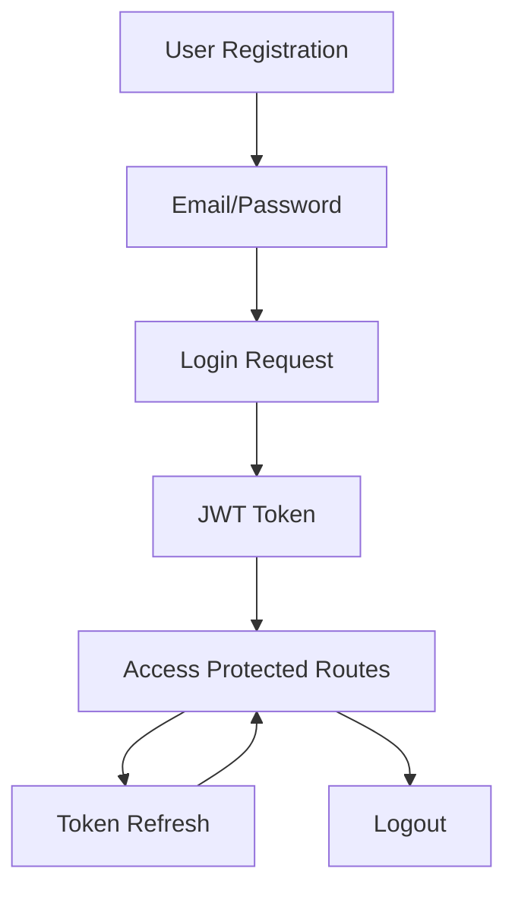

# Auth Service API Documentation & Testing Guide

> **Developer Note**: This document provides comprehensive API testing commands and examples for the Authentication Service microservice.

---

## 📋 Table of Contents

1. [Service Overview](#service-overview)
2. [Authentication Flow](#authentication-flow)
3. [API Endpoints](#api-endpoints)
4. [Testing Examples](#testing-examples)
5. [Error Handling](#error-handling)
6. [Development Tips](#development-tips)

---

## 🏗️ Service Overview

**Service**: Authentication Service  
**Port**: 8001  
**Base URL**: `http://localhost:8001/api`  
**Purpose**: User authentication, authorization, and role management  

### Key Features
- JWT-based authentication
- Role-based access control (RBAC)
- User registration and management
- Service-to-service communication
- Health monitoring

---

## 🔐 Authentication Flow



### Authentication Headers
```bash
Authorization: Bearer <JWT_TOKEN>
Content-Type: application/json
```

---

## 🚀 API Endpoints

### 🔓 Public Endpoints (No Authentication)

#### 1. Health Check
```bash
GET /api/health
```
**Purpose**: Service health monitoring  
**Response**: Service status and version info

#### 2. Service Information
```bash
GET /api/info
```
**Purpose**: Complete API documentation  
**Response**: All available endpoints

#### 3. User Registration
```bash
POST /api/auth/register
```
**Purpose**: Create new user account  
**Auth**: None required

#### 4. User Login
```bash
POST /api/auth/login
```
**Purpose**: Authenticate and get JWT token  
**Auth**: None required

---

### 🔒 Protected Endpoints (JWT Required)

#### 5. Get User Profile
```bash
GET /api/auth/me
```
**Purpose**: Get current user details with roles/permissions  
**Auth**: JWT token required

#### 6. Refresh Token
```bash
POST /api/auth/refresh
```
**Purpose**: Get new JWT token  
**Auth**: Valid JWT token required

#### 7. User Logout
```bash
POST /api/auth/logout
```
**Purpose**: Invalidate current token  
**Auth**: JWT token required

---

### 🔗 Internal Endpoints (Service-to-Service)

#### 8. Get User by ID
```bash
GET /api/users/{id}
```
**Purpose**: Retrieve user details for other services  
**Auth**: JWT token required

#### 9. Assign Role to User
```bash
POST /api/users/{id}/roles
```
**Purpose**: Assign role to specific user  
**Auth**: JWT token required

#### 10. Get User Permissions
```bash
GET /api/users/{id}/permissions
```
**Purpose**: Get all user permissions  
**Auth**: JWT token required

#### 11. Validate User
```bash
POST /api/users/validate
```
**Purpose**: Check if user exists and is active  
**Auth**: JWT token required

---

## 🧪 Testing Examples

### Quick Start Test

```bash
# 1. Check service health
curl -s http://localhost:8001/api/health | jq .

# 2. Register new user
REGISTER_RESPONSE=$(curl -s -X POST \
  http://localhost:8001/api/auth/register \
  -H "Content-Type: application/json" \
  -d '{
    "name": "Developer Test",
    "email": "devtest@example.com",
    "password": "SecurePass123!",
    "password_confirmation": "SecurePass123!"
  }')

echo "Registration Response:"
echo $REGISTER_RESPONSE | jq .

# 3. Extract token
TOKEN=$(echo $REGISTER_RESPONSE | jq -r '.data.token')
echo "Token: ${TOKEN:0:50}..."

# 4. Get user profile
curl -s -X GET \
  http://localhost:8001/api/auth/me \
  -H "Authorization: Bearer $TOKEN" | jq .

# 5. Logout
curl -s -X POST \
  http://localhost:8001/api/auth/logout \
  -H "Authorization: Bearer $TOKEN" | jq .
```

### Complete API Test Suite

```bash
#!/bin/bash
# Complete API testing script

BASE_URL="http://localhost:8001/api"
EMAIL="testuser$(date +%s)@example.com"
PASSWORD="SecurePass123!"
NAME="Test User"

echo "🧪 Testing Auth Service API..."

# Test 1: Health Check
echo -e "\n1️⃣ Health Check"
curl -s "$BASE_URL/health" | jq .

# Test 2: Service Info
echo -e "\n2️⃣ Service Information"
curl -s "$BASE_URL/info" | jq .

# Test 3: Registration
echo -e "\n3️⃣ User Registration"
REGISTER_RESPONSE=$(curl -s -X POST "$BASE_URL/auth/register" \
  -H "Content-Type: application/json" \
  -d "{\"name\":\"$NAME\",\"email\":\"$EMAIL\",\"password\":\"$PASSWORD\",\"password_confirmation\":\"$PASSWORD\"}")

echo $REGISTER_RESPONSE | jq .
TOKEN=$(echo $REGISTER_RESPONSE | jq -r '.data.token')

# Test 4: Login
echo -e "\n4️⃣ User Login"
LOGIN_RESPONSE=$(curl -s -X POST "$BASE_URL/auth/login" \
  -H "Content-Type: application/json" \
  -d "{\"email\":\"$EMAIL\",\"password\":\"$PASSWORD\"}")

echo $LOGIN_RESPONSE | jq .
TOKEN=$(echo $LOGIN_RESPONSE | jq -r '.data.token')

# Test 5: Get Profile
echo -e "\n5️⃣ Get User Profile"
curl -s -X GET "$BASE_URL/auth/me" \
  -H "Authorization: Bearer $TOKEN" | jq .

# Test 6: Refresh Token
echo -e "\n6️⃣ Refresh Token"
REFRESH_RESPONSE=$(curl -s -X POST "$BASE_URL/auth/refresh" \
  -H "Authorization: Bearer $TOKEN")

echo $REFRESH_RESPONSE | jq .
TOKEN=$(echo $REFRESH_RESPONSE | jq -r '.data.token')

# Test 7: Logout
echo -e "\n7️⃣ User Logout"
curl -s -X POST "$BASE_URL/auth/logout" \
  -H "Authorization: Bearer $TOKEN" | jq .

# Test 8: Invalid Token (should fail)
echo -e "\n8️⃣ Invalid Token Test"
curl -s -X GET "$BASE_URL/auth/me" \
  -H "Authorization: Bearer invalid_token" | jq .

echo -e "\n✅ API Testing Complete!"
```

### Internal Service Communication

```bash
# For microservice communication testing
TOKEN="your_service_token_here"

# Get user details
curl -s -X GET "$BASE_URL/users/1" \
  -H "Authorization: Bearer $TOKEN" | jq .

# Assign role to user
curl -s -X POST "$BASE_URL/users/1/roles" \
  -H "Authorization: Bearer $TOKEN" \
  -H "Content-Type: application/json" \
  -d '{"role_id": 2}' | jq .

# Get user permissions
curl -s -X GET "$BASE_URL/users/1/permissions" \
  -H "Authorization: Bearer $TOKEN" | jq .

# Validate user
curl -s -X POST "$BASE_URL/users/validate" \
  -H "Authorization: Bearer $TOKEN" \
  -H "Content-Type: application/json" \
  -d '{"user_id": 1}' | jq .
```

---

## 🚨 Error Handling

### Common HTTP Status Codes

| Code | Meaning | Example Scenario |
|------|---------|------------------|
| 200 | Success | Login successful |
| 201 | Created | User registered |
| 401 | Unauthorized | Invalid/missing token |
| 404 | Not Found | User doesn't exist |
| 422 | Validation Error | Invalid input data |
| 500 | Server Error | Internal service error |

### Error Response Format

```json
{
  "success": false,
  "message": "Error description",
  "errors": {
    "field": ["Error message"]
  }
}
```

### Testing Error Scenarios

```bash
# Test invalid credentials
curl -s -X POST "$BASE_URL/auth/login" \
  -H "Content-Type: application/json" \
  -d '{"email":"wrong@example.com","password":"wrong"}' | jq .

# Test missing token
curl -s -X GET "$BASE_URL/auth/me" | jq .

# Test validation errors
curl -s -X POST "$BASE_URL/auth/register" \
  -H "Content-Type: application/json" \
  -d '{"name":"","email":"invalid","password":"123"}' | jq .
```

---

## 💻 Development Tips

### Environment Setup

```bash
# Required tools
sudo apt update
sudo apt install -y curl jq

# Set environment variables
export AUTH_SERVICE_URL="http://localhost:8001"
export TEST_USER_EMAIL="devtest@example.com"
export TEST_USER_PASSWORD="SecurePass123!"
```

### Debugging Tips

1. **Use verbose curl output**:
```bash
curl -v -X POST "$BASE_URL/auth/login" \
  -H "Content-Type: application/json" \
  -d '{"email":"test@example.com","password":"password"}'
```

2. **Check response headers**:
```bash
curl -I "$BASE_URL/health"
```

3. **Time responses**:
```bash
curl -w "@curl-format.txt" -s "$BASE_URL/health"
```

4. **Test with different user roles**:
```bash
# Test with admin user
curl -s -X POST "$BASE_URL/auth/login" \
  -H "Content-Type: application/json" \
  -d '{"email":"admin1@test.com","password":"password"}' | jq .

# Test with coach user  
curl -s -X POST "$BASE_URL/auth/login" \
  -H "Content-Type: application/json" \
  -d '{"email":"coach1@test.com","password":"password"}' | jq .
```

### Performance Testing

```bash
# Load test registration endpoint
for i in {1..10}; do
  curl -s -X POST "$BASE_URL/auth/register" \
    -H "Content-Type: application/json" \
    -d "{\"name\":\"User $i\",\"email\":\"user$i@test.com\",\"password\":\"password\",\"password_confirmation\":\"password\"}" &
done
wait

# Test concurrent logins
for i in {1..5}; do
  curl -s -X POST "$BASE_URL/auth/login" \
    -H "Content-Type: application/json" \
    -d '{"email":"admin1@test.com","password":"password"}' &
done
wait
```

### Integration Testing

```bash
# Test complete user lifecycle
echo "🔄 Testing User Lifecycle..."

# 1. Register
REGISTER=$(curl -s -X POST "$BASE_URL/auth/register" \
  -H "Content-Type: application/json" \
  -d '{"name":"Lifecycle Test","email":"lifecycle@test.com","password":"password","password_confirmation":"password"}')

# 2. Login
TOKEN=$(echo $REGISTER | jq -r '.data.token')

# 3. Get profile
PROFILE=$(curl -s -X GET "$BASE_URL/auth/me" \
  -H "Authorization: Bearer $TOKEN")

# 4. Refresh token
NEW_TOKEN=$(curl -s -X POST "$BASE_URL/auth/refresh" \
  -H "Authorization: Bearer $TOKEN" | jq -r '.data.token')

# 5. Logout
curl -s -X POST "$BASE_URL/auth/logout" \
  -H "Authorization: Bearer $NEW_TOKEN"

echo "✅ Lifecycle test completed"
```

---

## 📚 Reference Data

### Default Test Users (from seeders)

```bash
# Administrators
admin1@test.com (password: password)
admin2@test.com (password: password)  
admin3@test.com (password: password)

# Coaches
coach1@test.com through coach20@test.com (password: password)

# Referees  
referee1@test.com through referee10@test.com (password: password)
```

### Role IDs

| Role | ID | Permissions |
|------|----|-------------|
| Administrator | 1 | All permissions |
| Coach | 2 | manage_players |
| Referee | 3 | record_events, submit_reports |

### Permission Names

- `manage_sports` - Manage sports and categories
- `manage_tournaments` - Manage tournaments
- `manage_venues` - Manage venues
- `manage_teams` - Manage teams
- `manage_players` - Manage players
- `manage_matches` - Manage matches
- `record_events` - Record match events
- `submit_reports` - Submit match reports

---

## 🔧 Troubleshooting

### Common Issues

1. **Connection refused**: Service not running
```bash
# Check if service is up
curl -I http://localhost:8001/api/health

# Start service
cd auth-service && php artisan serve --host=0.0.0.0 --port=8001
```

2. **Database connection errors**: Database not running
```bash
# Check MySQL container
docker ps | grep mysql

# Start database
docker-compose up -d auth-db
```

3. **JWT token errors**: Invalid configuration
```bash
# Check JWT secret
grep JWT_SECRET .env

# Regenerate JWT secret
php artisan jwt:secret
```

4. **Permission denied**: File permissions
```bash
# Fix storage permissions
chmod -R 755 storage bootstrap/cache
chown -R www-data:www-data storage bootstrap/cache
```

---

## 📞 Support

For issues with the Auth Service:
1. Check service logs: `php artisan log:tail`
2. Verify database connections
3. Check JWT configuration
4. Review environment variables

**Developer Team**: Sports Tournament System  
**Last Updated**: $(date)  
**Version**: 1.0.0
