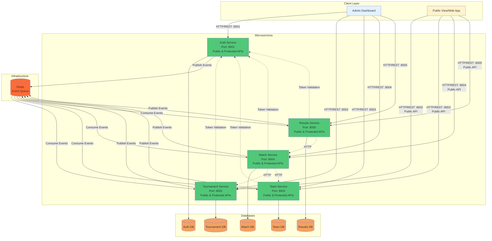
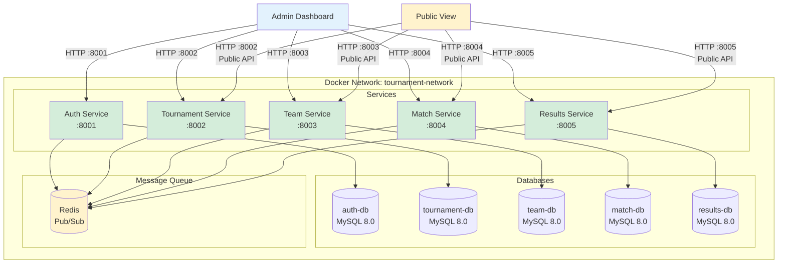
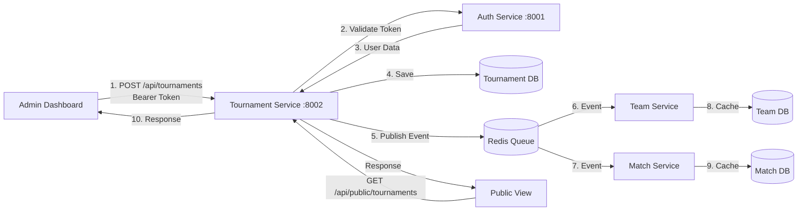
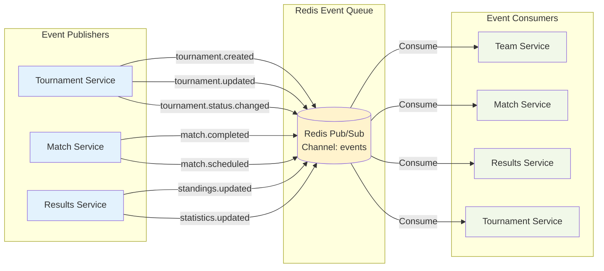
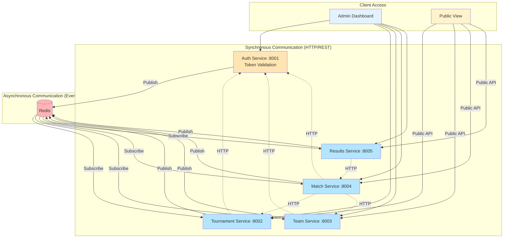
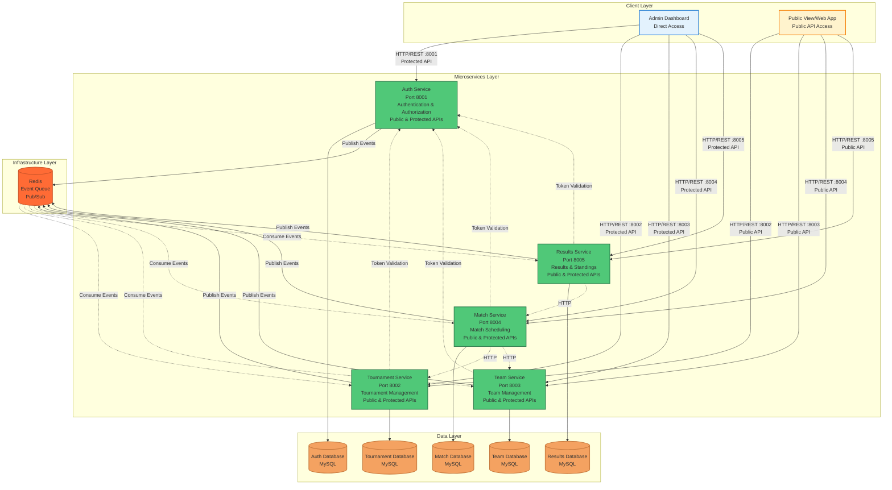

# How to Create Architecture Diagrams

## Recommended Tools/Websites

### 1. **Draw.io (diagrams.net)** ⭐ Recommended
- **Website**: https://app.diagrams.net/ (or https://draw.io)
- **Why**: 
  - Free, no account required
  - Professional-looking diagrams
  - Can save to Google Drive, GitHub, or locally
  - Export to PNG, SVG, PDF
  - Great templates for architecture diagrams
- **Best for**: System architecture, deployment diagrams, detailed flows

### 2. **Mermaid Live Editor** (Free - Text-based)
- **Website**: https://mermaid.live/
- **Why**: 
  - Free, no account required
  - Text-based (easy to version control)
  - Can be embedded in markdown files
  - Supports multiple diagram types
- **Best for**: Quick diagrams, documentation, markdown files

### 3. **Lucidchart** (Paid - Professional)
- **Website**: https://www.lucidchart.com/
- **Why**:
  - Professional templates
  - Collaboration features
  - Good for presentations
- **Best for**: Team collaboration, professional presentations

### 4. **PlantUML** (Free - Text-based)
- **Website**: http://www.plantuml.com/plantuml/uml/
- **Why**:
  - Text-based syntax
  - Can be integrated into documentation
  - Good for version control
- **Best for**: Developers who prefer text-based tools

---

## Types of Architecture Diagrams

### 1. **System Architecture Diagram**
Shows all services, databases, and their relationships

### 2. **Deployment Diagram**
Shows how services are deployed (Docker containers, ports, networks)

### 3. **Data Flow Diagram**
Shows how data flows between services

### 4. **Event Flow Diagram**
Shows event-driven communication patterns

### 5. **Component Diagram**
Shows internal components of each service

---

## Step-by-Step: Creating Architecture Diagrams

### Option 1: Using Draw.io (Recommended for Visual Diagrams)

#### Step 1: Open Draw.io
1. Go to: https://app.diagrams.net/
2. Click **"Create New Diagram"**
3. Choose **"Blank Diagram"** or search for "AWS Architecture" or "Azure Architecture" templates

#### Step 2: Add Services (Boxes)
1. **Drag "Rectangle" shapes** from the left panel
2. **Label each service**:
   - Auth Service (Port 8001)
   - Tournament Service (Port 8002)
   - Team Service (Port 8003)
   - Match Service (Port 8004)
   - Results Service (Port 8005)

#### Step 3: Add Databases
1. **Use "Database" icon** from shapes (or use cylinder shape)
2. **Label each database**:
   - Auth DB
   - Tournament DB
   - Team DB
   - Match DB
   - Results DB

#### Step 4: Add Infrastructure Components
1. **Add Redis** (use cloud or queue icon)
2. **Add Docker Network** (use container/network icon)

#### Step 5: Connect Components
1. **Use "Arrow" tool** to connect:
   - Admin Dashboard → All Services (Protected APIs)
   - Public View → Services (Public APIs only)
   - Services → Their Databases
   - Services → Redis (for events)
   - Services → Auth Service (for token validation)

#### Step 6: Add Labels
1. **Label connections**:
   - "HTTP/REST :8001" for Auth Service calls
   - "HTTP/REST :8002" for Tournament Service calls
   - "Public API" for public endpoints
   - "Protected API" for authenticated endpoints
   - "Redis Pub/Sub" for events
   - "Token Validation" for auth calls

#### Step 7: Style Your Diagram
1. **Use colors**:
   - Blue for services
   - Green for databases
   - Orange for infrastructure (Redis)
   - Gray for network
2. **Group related components** using containers

#### Step 8: Export
1. **File → Export As → PNG** (for images)
2. **File → Export As → SVG** (for scalable vector)
3. **File → Save As → .drawio** (to edit later)

---

### Option 2: Using Mermaid (Text-based)

#### Step 1: Go to Mermaid Live Editor
1. Visit: https://mermaid.live/
2. Choose diagram type from the left panel

#### Step 2: Copy and Customize Code
See examples below for ready-to-use Mermaid code

---

## Mermaid Architecture Diagram Examples

### 1. System Architecture Diagram (Complete)



### 2. Deployment Architecture Diagram



### 3. Data Flow Diagram



### 4. Event Flow Diagram



### 5. Service Communication Pattern



---

## Draw.io Component Library

### Shapes to Use:

1. **Services**: 
   - Rectangle with rounded corners
   - Add port numbers in label
   - Use consistent colors

2. **Databases**: 
   - Cylinder shape (database icon)
   - Or use rectangle with database icon overlay

3. **Message Queue**: 
   - Cloud shape for Redis
   - Or queue icon

4. **Network**: 
   - Container/group shape
   - Label as "Docker Network"

5. **Connections**:
   - Solid arrow: Synchronous (HTTP)
   - Dashed arrow: Asynchronous (Events)
   - Different colors for different protocols

---

## Architecture Diagram Checklist

### System Architecture Diagram Should Include:
- [ ] All microservices (5 services: Auth, Tournament, Team, Match, Results)
- [ ] Client applications (Admin Dashboard, Public View)
- [ ] All databases (5 databases)
- [ ] Redis message queue
- [ ] Direct client-to-service connections
- [ ] Public API vs Protected API distinction
- [ ] Service-to-service communication
- [ ] Database connections
- [ ] Event flow connections
- [ ] Port numbers (8001-8005)
- [ ] Network boundaries

### Deployment Diagram Should Include:
- [ ] Docker containers (5 services)
- [ ] Port mappings (8001-8005)
- [ ] Network configuration (tournament-network)
- [ ] Database containers (5 databases)
- [ ] Volume mounts
- [ ] Service dependencies
- [ ] Client access points (Admin Dashboard, Public View)

### Data Flow Diagram Should Include:
- [ ] Request flow
- [ ] Response flow
- [ ] Data storage
- [ ] Event publishing
- [ ] Event consumption
- [ ] Numbered steps

---

## Tips for Creating Good Architecture Diagrams

1. **Keep it Simple**: Don't overcrowd - focus on main components
2. **Use Consistent Colors**: 
   - Services: Blue/Green
   - Databases: Orange/Yellow
   - Infrastructure: Red/Orange
   - Network: Gray
3. **Group Related Components**: Use containers/boxes
4. **Label Everything**: Ports, protocols, data types
5. **Show Direction**: Use arrows to show data/request flow
6. **Use Layers**: Client → Gateway → Services → Databases
7. **Add Legends**: Explain colors, line styles, symbols
8. **Version Control**: Save source files (.drawio) for easy updates

---

## Quick Start: Draw.io Template

### Step-by-Step for Your System:

1. **Create New Diagram** → Blank Diagram

2. **Add Layers (from top to bottom)**:
   - Client Layer (Admin Dashboard, Public View)
   - Services Layer (5 microservices)
   - Database Layer (5 databases)
   - Infrastructure Layer (Redis)

3. **Add Components**:
   ```
   Top Row: [Admin Dashboard] [Public View]
   Second Row: [Auth:8001] [Tournament:8002] [Team:8003] [Match:8004] [Results:8005]
   Third Row: [Auth DB] [Tournament DB] [Team DB] [Match DB] [Results DB]
   Bottom: [Redis]
   ```

4. **Connect**:
   - Admin Dashboard → All Services (solid arrows, label "Protected API")
   - Public View → Services (solid arrows, label "Public API", exclude Auth)
   - Services → Databases (solid arrows)
   - Services → Redis (dashed arrows for events)
   - Services → Auth (dashed arrows for token validation)

5. **Style**:
   - Services: Light blue/green background
   - Databases: Light orange background
   - Redis: Light yellow background
   - Admin Dashboard: Light blue background
   - Public View: Light yellow background

6. **Add Labels**:
   - "HTTP/REST" on synchronous connections
   - "Redis Pub/Sub" on event connections
   - "Token Validation" on auth connections

---

## Exporting and Using Your Diagrams

### For Documentation:
- **PNG**: High resolution (1920x1080 or higher)
- **SVG**: For scalable vector graphics
- **PDF**: For printing or presentations

### For Presentations:
- Export as PNG at 1920x1080 resolution
- Use SVG for scalability
- Consider creating multiple diagrams for different aspects

### For README.md:
- Use Mermaid code (if using Mermaid)
- Or embed PNG/SVG images
- Add alt text for accessibility

---

## Example: Complete System Architecture (Mermaid)



---

## Additional Resources

- **Draw.io Tutorial**: https://www.diagrams.net/blog/architecture-diagrams
- **Mermaid Documentation**: https://mermaid.js.org/
- **AWS Architecture Icons**: https://aws.amazon.com/architecture/icons/
- **Azure Architecture Icons**: https://docs.microsoft.com/en-us/azure/architecture/icons/

---

## Next Steps

1. **Choose your tool** (Draw.io recommended for visual, Mermaid for text-based)
2. **Start with System Architecture** (most important)
3. **Create Deployment Diagram** (shows infrastructure)
4. **Create Data Flow Diagram** (shows how data moves)
5. **Add to README.md** (embed or link diagrams)
6. **Update documentation** (reference diagrams in docs)

Good luck creating your architecture diagrams! 🎨
