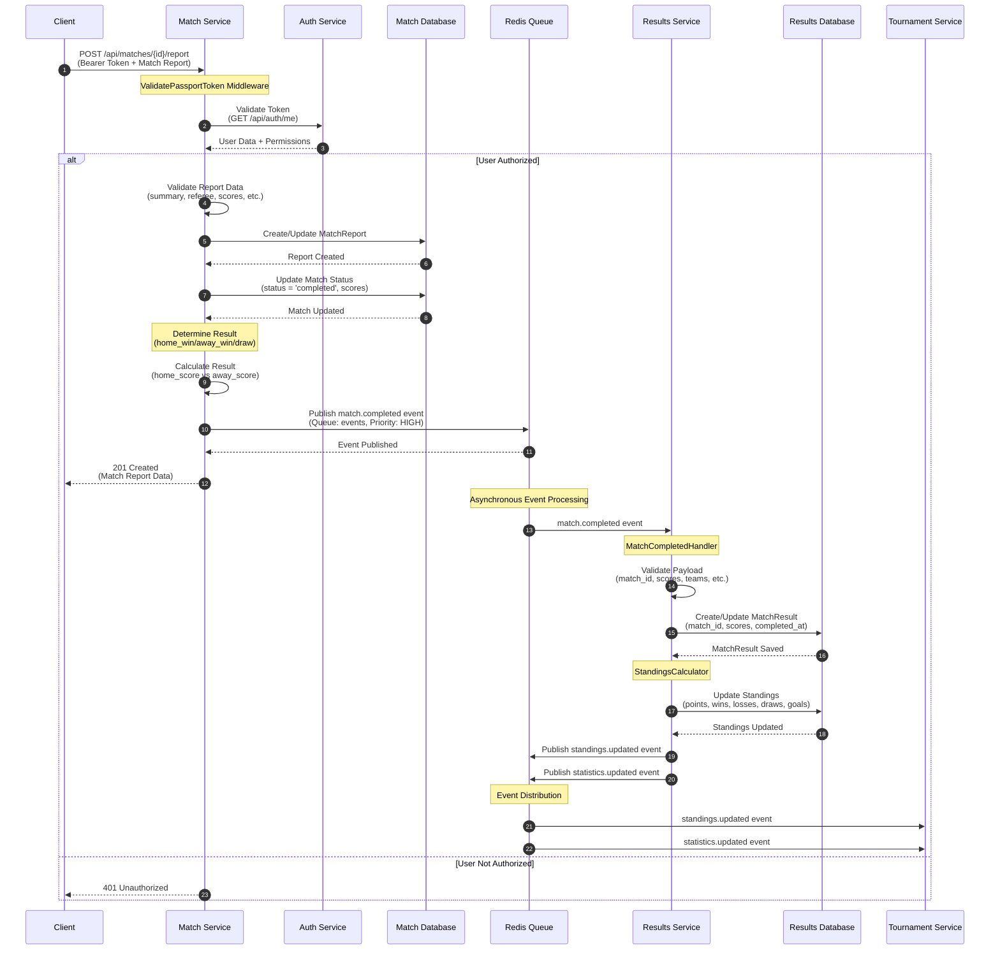
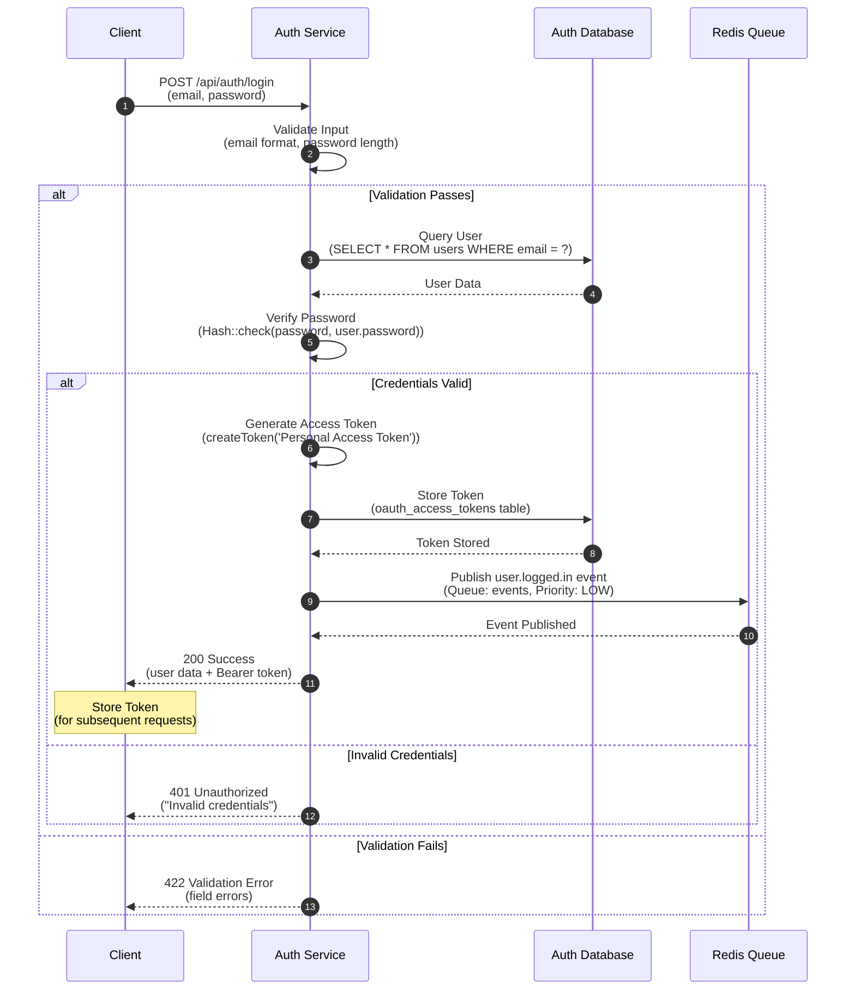
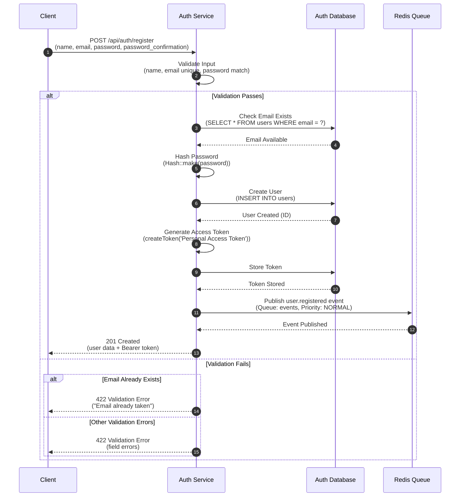
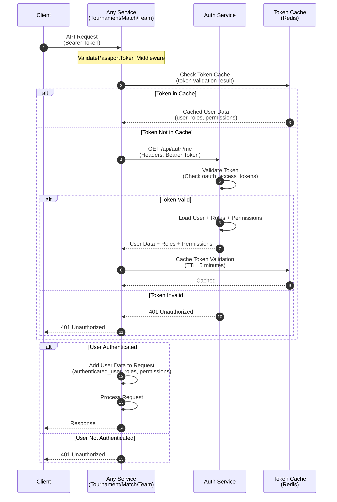

# Mermaid Sequence Diagrams

## 1. Match Completion Flow

## 2. User Authentication Flow

## 3. User Registration Flow (Bonus)

## 4. Token Validation Flow (Used by Other Services)

---

## Usage Instructions

1. **Copy the Mermaid code** for the diagram you need
2. **Go to**: https://mermaid.live/
3. **Paste the code** into the editor
4. **Customize** as needed
5. **Export** as PNG or SVG

## Notes

- All diagrams use `autonumber` for step numbering
- Replace service names with your actual service names if different
- Adjust the flow based on your specific implementation
- Add error handling flows as needed
